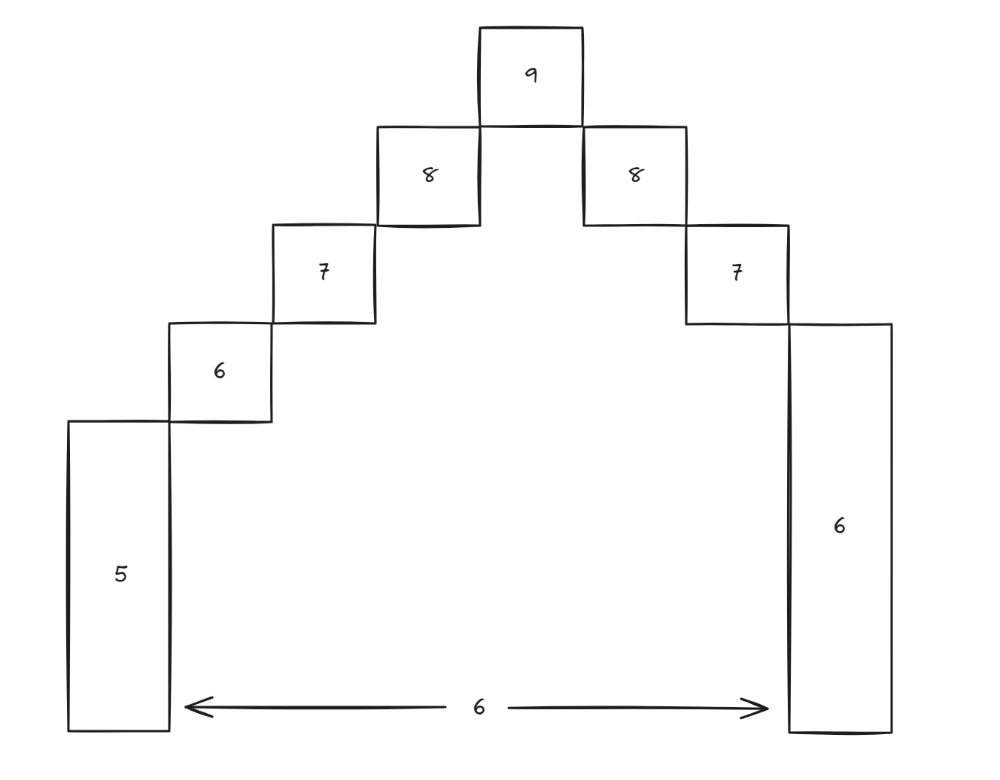

**Difficulty Level**: Medium\
Little Chris is afraid of deathly afraid of heights. He wants to know the how high the staircase will get 
before he steps on. Can you help him find the maximum height of the stairs?\
You are given the height of the initial step, ending height and how many spaces are between them. Each 

**Input:**\
The first input is starting height - *integer*\
The second input is the height the staircase must end on - *integer*\
The third input is the spacing between the first 

**Output:**\
The maximum area possible given the Joe's budget and cost of fencing - *integer*

**Example:**\
Input: budget=640.0, fenceCost=8.0\
Output: 800\
**Explanation**:\
Having a fence with a length of 40 and a width of 20 means 80m of fencing material and will cost $640. This will give
an area of 800, which is the maximum area.

