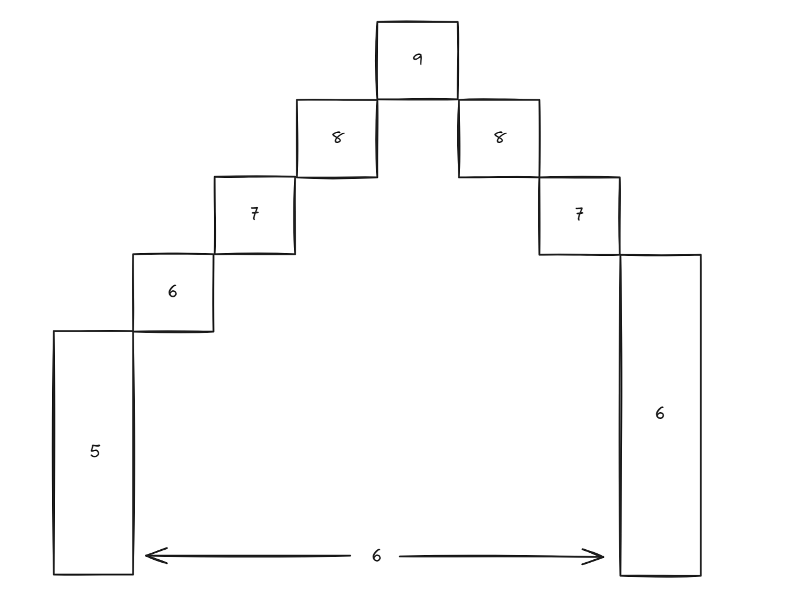

**Solution Writeup**\
The amount of steps it takes to reach the maximum height is given by the (maximum height - startHeight). 
The remaining steps required to reach the end is given by (length - stepsTakenToReachMaxHeight). Finally, 
the ending height is given by (maxHeight - remainingSteps - 1). So we estimate a maximum height. With 
that estimate max height, we calculate stepsTakenToMax, remainingSteps and an estimateEndHeight. If the 
estimateEndHeight is equal to the real endHeight, this is the solution. If not, try another number as 
the maximum height.\

